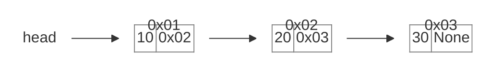
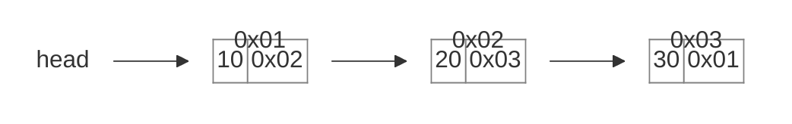
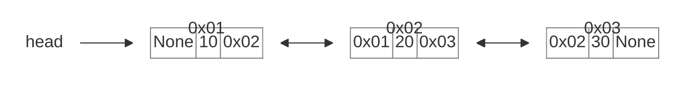
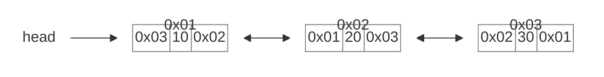

## 1.内存的存储结构

内存以**字节**为基本存储单位，每个基本存储空间都有自己的**地址**（一个内存地址代表一个字节，即 8bit 的存储空间）。

常见类型占用的字节数：

- **int**：4 字节
- **char**：1 字节（单个字符 `"a"` 占 1 字节，字符串 `"abc"` 占 3 字节）

## 2.线性结构的存储方式

线性结构在实际存储时有两种方式：**顺序表**和**链表**。

### 2.1 顺序表（连续存储）

将元素**顺序地存放在一块连续的存储区**里，元素间的顺序关系由它们的存储顺序自然表示。

顺序表有两种整体结构：

- **一体式结构**：信息区和数据区存储在一起，扩容时信息区和数据区一起拷贝
- **分离式结构**：信息区和数据区分开存储，扩容时只需扩容数据区

顺序表通过**下标偏移**即可直接找到数据所在地址，无需遍历，所以**获取数据的时间复杂度为 O(1)**。

#### 2.1.1 顺序表的存储结构

顺序表的完整信息包括两部分：

1. **数据区**：存放实际元素
2. **信息区**：记录元素存储区的容量和当前表中已有的元素个数

#### 2.1.2 顺序表的扩容

扩充有两种策略：

| 策略 | 说明 | 特点 |
|:---:|:---:|:---:|
| 线性增长 | 每次扩充增加固定数目的存储位置（如每次增加 10 个元素位置） | 节省空间，但扩充操作频繁；以**时间换空间** |
| 容量加倍 | 每次扩充增加一倍存储空间 | 减少扩充操作次数，但可能浪费空间；以**空间换时间**（推荐） |

#### 2.1.3 元素存储区的替换

- **一体式存储**：元素存储在连续空间，扩容时只能**整体搬迁**，信息区和数据区都改变
- **分离式存储**：扩容时可只整体更换**数据区**，信息区的链接更新即可

#### 2.1.4 添加元素

| 插入位置 | 时间复杂度 |
|:---:|:---:|
| 尾端插入 | `O(1)` |
| 非保序插入（不常见） | `O(1)` |
| 保序插入 | `O(n)` |

#### 2.1.5 删除元素

| 删除位置 | 时间复杂度 |
|:---:|:---:|
| 删除表尾元素 | `O(1)` |
| 删除非保序元素（不常见） | `O(1)` |
| 删除保序元素 | `O(n)` |

### 2.2 链表（非连续存储）

将元素存放在通过**链接构造起来的一系列存储块**中，存储区是**非连续**的。

#### 2.2.1 顺序表的不足

顺序表存储时需要**连续的内存空间**，当要扩充顺序表时会出现以下两种情况：

- 内存充足时，容易找到连续的内存空间
- 内存不充足时，难以找到连续的内存空间，**无法完成扩容**

因此，需要一种**不依赖连续内存**的存储结构——链表由此产生。

#### 2.2.2 链表结构

**单链表（单向链表）**是链表的一种形式，每个结点包含两个域：**item（元素域）**和 **next（链接域）**。


- **item（元素域）**：存放该结点的数据
- **next（链接域）**：存放指向下一个结点的引用（地址）；若为最后一个结点，则指向空值 `None`
- **`head`** 指向链表的头结点，是访问整条链表的**入口**——从 `head` 出发，沿着各结点的 `next` 依次访问，就能到达链表中的任意结点。

#### 2.2.3 链表的分类

根据**结点结构**的不同（是否含前驱指针、是否首尾相连），链表可以分为四大类。下面以 `[10, 20, 30]` 为例说明（结点上方的 `0x01/0x02/0x03` 是该结点在内存中的**地址**，结点内的格子存放**数据**与**指针**）：

**单向链表**：每个结点只包含**数据**和 **next 指针**，只能从头向尾单向访问。



**单向循环链表**：在单向链表的基础上，**尾结点的 next 指回头结点**，首尾相连成环。



**双向链表**：每个结点包含 **prev 指针 + 数据 + next 指针**，可以向前、向后双向访问。



**双向循环链表**：在双向链表的基础上**首尾相连**——头结点的 prev 指向尾结点，尾结点的 next 指向头结点。



| 类型 | 结点结构 | 访问方向 | 尾结点 next | 头结点 prev |
|:---:|:---:|:---:|:---:|:---:|
| 单向链表 | 数据 + next | 仅向后 | `None` | — |
| 单向循环链表 | 数据 + next | 仅向后 | 头结点 | — |
| 双向链表 | prev + 数据 + next | 前后均可 | `None` | `None` |
| 双向循环链表 | prev + 数据 + next | 前后均可 | 头结点 | 尾结点 |

## 3.自定义代码模拟链表

### 3.1 思路分析

1. 自定义 `SingleNode` 类，表示**节点**：
   - **属性**：`item`（数值域/元素域）、`next`（地址域/链接域）
2. 自定义 `SingleLinkedList` 类，表示**链表**：
   - **属性**：`head`（指向第一个节点）
   - **行为**：
     - `is_empty(self)` 链表是否为空
     - `length(self)` 链表长度
     - `travel(self)` 遍历整个链表
     - `add(self, item)` 链表头部添加元素
     - `append(self, item)` 链表尾部添加元素
     - `insert(self, pos, item)` 指定位置添加元素
     - `remove(self, item)` 删除节点
     - `search(self, item)` 查找节点是否存在

### 3.2 自定义SingleNode类

自定义SingleNode类，表示节点类，存储数值域（元素域）和地址域（链接域）。

```python title="02.自定义代码模拟链表.py"
class SingleNode:
    def __init__(self, item):
        self.item = item
        self.next = None
```

### 3.3 自定义SingleLinkedList类

自定义SingleLinkedList类，表示链表类，存储头节点。

```python title="02.自定义代码模拟链表.py"
class SingleLinkedList:
    def __init__(self, head: SingleNode = None):
        self.head = head
```

### 3.4 判断链表是否为空

链表是否为空的判断，即判断头节点是否为空。

```python title="02.自定义代码模拟链表.py"
def is_empty(self):
    """
    链表是否为空
    :return: 是否为空
    """
    return self.head is None
```

### 3.5 获取链表长度

获取链表长度，即遍历整个链表，统计节点个数。

```python title="02.自定义代码模拟链表.py"
def length(self):
    """
    链表长度
    :return: 链表长度
    """
    # 定义计数器
    length = 0
    # 创建游标，默认从头节点开始
    curr = self.head
    while curr is not None:
        # 计数器 + 1，然后将游标指向下一个节点
        length += 1
        curr = curr.next

    return length
```

### 3.6 遍历链表

遍历链表，即打印整个链表。

```python title="02.自定义代码模拟链表.py"
def travel(self):
    """
    遍历整个链表
    :return: 遍历结果
    """
    # 创建游标，默认从头节点开始
    curr = self.head

    # 只要当前节点不为空，就一直循环
    while curr is not None:
        print(f"数值域：{curr.item}")
        # 将游标指向下一个节点
        curr = curr.next
```

### 3.7 链表头部添加元素

链表头部添加元素，即创建一个节点，将节点的 next 指向头节点，将头节点指向新节点。

```python title="02.自定义代码模拟链表.py"
def add(self, item):
    """
    链表头部添加元素
    :param item: 元素
    :return: 无
    """
    # 创建新节点
    new_node = SingleNode(item)
    # 设置新节点的地址域指向头节点
    new_node.next = self.head
    # 设置头节点指向新节点
    self.head = new_node
```

### 3.8 链表尾部添加元素

链表尾部添加元素，即创建一个新节点，找到链表**最后一个节点**，将它的 `next` 指向新节点（新节点的 `next` 默认为 `None`）。

```python title="02.自定义代码模拟链表.py"
def append(self, item):
    """
    链表尾部添加元素
    :param item: 元素
    :return: 无
    """
    # 创建新节点
    new_node = SingleNode(item)

    # 判断链表如果为空，直接设置当前节点为头节点
    if self.is_empty():
        self.head = new_node
        return

    # 创建游标，默认从头节点开始
    curr = self.head

    # 只要当前节点的下一个节点不为空，就一直循环
    while curr.next is not None:
        curr = curr.next

    # 走到这里，curr就是最后一个节点，设置它的地址指向新节点即可
    curr.next = new_node
```

### 3.9 指定位置添加元素

指定位置添加元素，即创建一个新节点，**先让新节点的 `next` 指向插入位置的后一个节点，再让前一个节点的 `next` 指向新节点**。

```python title="02.自定义代码模拟链表.py"
def insert(self, pos, item):
    """
    在指定位置添加元素
    :param pos: 索引
    :param item: 元素
    :return: 无
    """
    # 头部添加新节点
    if pos <= 0:
        self.add(item)
    # 尾部添加新节点
    elif pos >= self.length():
        self.append(item)
    # 添加新节点
    else:
        # 定义变量，记录当前节点的位置（可以理解为索引，但不是，因为链表没有索引）
        index = 0
        # 当前节点
        curr = self.head

        # 找到插入位置的前一个节点
        while index < pos - 1:
            # 走到这里说明还没有找到插入前的那个节点，就节点后移，计数器+1
            curr = curr.next
            index += 1

        # 走到这里说明已经找到插入节点的前一个节点
        # 创建新节点
        new_node = SingleNode(item)

        new_node.next = curr.next
        curr.next = new_node
```

### 3.10 删除节点

删除节点，即找到要删除的节点，将当前节点的 next 置为要删除节点的 next。

```python title="02.自定义代码模拟链表.py"
def remove(self, item):
    """
    删除节点
    :param item: 元素
    :return: 无
    """
    # 当前元素
    curr = self.head
    # 上一个元素
    last = None

    while curr is not None:
        # 找到要删除的节点
        if curr.item == item:
            # 如果不是头节点，将上一个节点的next指向当前节点的next
            if last is not None:
                last.next = curr.next
            # 如果是头节点，则将头节点指向当前节点的next
            else:
                self.head = curr.next
            # 删除成功，直接返回
            break
        else:
            last = curr
            curr = curr.next
```

### 3.11 查找节点

查找节点，即遍历整个链表，找到要查找的节点。

```python title="02.自定义代码模拟链表.py"
def search(self, item):
    """
    查找节点是否存在
    :param item: 节点
    :return: 是否存在
    """
    # 当前元素
    curr = self.head

    while curr is not None:
        # 找到节点
        if curr.item == item:
            return True

        curr = curr.next

    return False
```

各方法的**时间复杂度**总结：

| 方法 | 功能 | 时间复杂度 |
|:---:|:---|:---:|
| `is_empty` | 判断是否为空 | `O(1)` |
| `length` | 链表长度 | `O(n)` |
| `travel` | 遍历打印 | `O(n)` |
| `add` | 头部添加 | `O(1)` |
| `append` | 尾部添加 | `O(n)` |
| `insert` | 指定位置添加 | `O(n)` |
| `remove` | 删除节点 | `O(n)` |
| `search` | 查找节点 | `O(n)` |

::: tip 说明
`add`（头部添加）只需修改 `head` 指向，所以是 `O(1)`；其余方法大多需要**遍历链表**定位节点，所以是 `O(n)`。
:::

### 3.12 链表与顺序表的复杂度对比

| 操作 | 顺序表 | 链表 |
|:---:|:---:|:---:|
| 按位置/下标访问 | `O(1)` 随机访问 | `O(n)` 需从头遍历 |
| 头部插入/删除 | `O(n)` 需整体移动元素 | `O(1)` 只需修改 `head` |
| 中部插入/删除 | `O(n)` 需移动元素 | `O(n)` 需遍历定位（修改本身是 `O(1)`） |
| 尾部插入 | `O(1)`（均摊） | `O(n)` 需遍历到末尾 |
| 尾部删除 | `O(1)` | `O(n)` 需遍历到末尾 |

::: tip 结论
- **顺序表**：随机访问快（`O(1)`），但中部插入/删除要**整体移动元素**，慢
- **链表**：头部操作快（`O(1)`），但随机访问慢（`O(n)`），且每个节点需**额外存储指针**

选择依据：**频繁按位置访问 → 顺序表；频繁在头部插入删除 → 链表**。
:::

### 3.13 完整代码

```python title="02.自定义代码模拟链表.py"
class SingleNode:
    def __init__(self, item):
        self.item = item
        self.next = None


class SingleLinkedList:
    def __init__(self, head: SingleNode = None):
        self.head = head

    def is_empty(self):
        """
        链表是否为空
        :return: 是否为空
        """
        return self.head is None

    def length(self):
        """
        链表长度
        :return: 链表长度
        """
        # 定义计数器
        length = 0
        # 创建游标，默认从头节点开始
        curr = self.head
        while curr is not None:
            # 计数器 + 1，然后将游标指向下一个节点
            length += 1
            curr = curr.next

        return length

    def travel(self):
        """
        遍历整个链表
        :return: 遍历结果
        """
        # 创建游标，默认从头节点开始
        curr = self.head

        # 只要当前节点不为空，就一直循环
        while curr is not None:
            print(f"数值域：{curr.item}")
            # 将游标指向下一个节点
            curr = curr.next

    def add(self, item):
        """
        链表头部添加元素
        :param item: 元素
        :return: 无
        """
        # 创建新节点
        new_node = SingleNode(item)
        # 设置新节点的地址域指向头节点
        new_node.next = self.head
        # 设置头节点指向新节点
        self.head = new_node

    def append(self, item):
        """
        链表尾部添加元素
        :param item: 元素
        :return: 无
        """
        # 创建新节点
        new_node = SingleNode(item)

        # 判断链表如果为空，直接设置当前节点为头节点
        if self.is_empty():
            self.head = new_node
            return

        # 创建游标，默认从头节点开始
        curr = self.head

        # 只要当前节点的下一个节点不为空，就一直循环
        while curr.next is not None:
            curr = curr.next

        # 走到这里，curr就是最后一个节点，设置它的地址指向新节点即可
        curr.next = new_node

    def insert(self, pos, item):
        """
        在指定位置添加元素
        :param pos: 索引
        :param item: 元素
        :return: 无
        """
        # 头部添加新节点
        if pos <= 0:
            self.add(item)
        # 尾部添加新节点
        elif pos >= self.length():
            self.append(item)
        # 添加新节点
        else:
            # 定义变量，记录当前节点的位置（可以理解为索引，但不是，因为链表没有索引）
            index = 0
            # 当前节点
            curr = self.head

            # 找到插入位置的前一个节点
            while index < pos - 1:
                # 走到这里说明还没有找到插入前的那个节点，就节点后移，计数器+1
                curr = curr.next
                index += 1

            # 走到这里说明已经找到插入节点的前一个节点
            # 创建新节点
            new_node = SingleNode(item)

            new_node.next = curr.next
            curr.next = new_node

    def remove(self, item):
        """
        删除节点
        :param item: 元素
        :return: 无
        """
        # 当前元素
        curr = self.head
        # 上一个元素
        last = None

        while curr is not None:
            # 找到要删除的节点
            if curr.item == item:
                # 如果不是头节点，将上一个节点的next指向当前节点的next
                if last is not None:
                    last.next = curr.next
                # 如果是头节点，则将头节点指向当前节点的next
                else:
                    self.head = curr.next
                # 删除成功，直接返回
                break
            else:
                last = curr
                curr = curr.next

    def search(self, item):
        """
        查找节点是否存在
        :param item: 节点
        :return: 是否存在
        """
        # 当前元素
        curr = self.head

        while curr is not None:
            # 找到节点
            if curr.item == item:
                return True

            curr = curr.next

        return False

if __name__ == '__main__':
    # 创建节点类
    node1 = SingleNode("Nanxu")

    # 将上述节点作为头节点，创建链表
    my_linked_list = SingleLinkedList(node1)

    # 测试链表是否为空
    print(my_linked_list.is_empty())
    print("-" * 23)

    # 测试链表长度
    print(my_linked_list.length())
    print("-" * 23)

    # 测试头部添加元素
    my_linked_list.add("Nanxu2")
    my_linked_list.add("Nanxu3")

    # 测试尾部添加元素
    my_linked_list.append("Nanxu4")
    my_linked_list.append("Nanxu5")

    # 测试指定位置添加元素
    my_linked_list.insert(5, "Nanxu6")
    my_linked_list.insert(1, "Nanxu7")

    # 测试删除元素
    my_linked_list.remove("Nanxu3")
    my_linked_list.remove("Nanxu6")

    # 测试查找元素
    print(my_linked_list.search("Nanxu6"))
    print("-" * 23)

    # 测试链表遍历
    my_linked_list.travel()
    print("-" * 23)
```

运行结果:

```
False
-----------------------
1
-----------------------
False
-----------------------
数值域：Nanxu7
数值域：Nanxu2
数值域：Nanxu
数值域：Nanxu4
数值域：Nanxu5
-----------------------
```