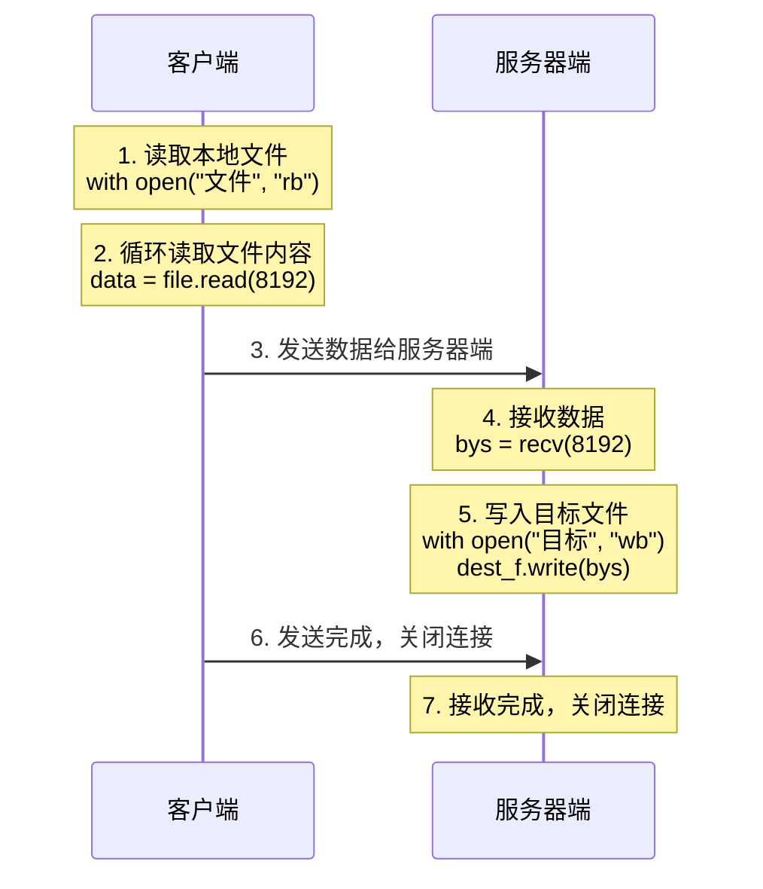

## 1.文件上传概述

### 1.1 什么是文件上传

文件上传是指客户端将文件数据发送给服务器端的过程。

::: info 说明
- 文件上传：客户端 → 服务器端
- 文件下载：服务器端 → 客户端

两者原理相同，只是方向相反。
:::

### 1.2 传输流程



## 2.服务器端代码

### 2.1 代码实现

```python title="06.网编案例_文件上传_服务器端.py"
import socket

# 创建服务器Socket对象
server_socket = socket.socket(socket.AF_INET, socket.SOCK_STREAM)

# 绑定端口
server_socket.bind(("127.0.0.1", 8080))

# 设置最大监听数
server_socket.listen(5)

# 等待客户端申请建立连接
accept_socket, info = server_socket.accept()

# 关联目的地文件
with open("data/my.txt", "wb") as dest_f:
    # 循环读取数据
    while True:
        # 接收客户端上传的文件
        bys = accept_socket.recv(8192)

        # 无数据，结束即可
        if len(bys) == 0:
            break

        # 把读取到的数据写入目的地文件中
        dest_f.write(bys)

accept_socket.close()
```

### 2.2 代码说明

| 步骤 | 代码 | 说明 |
|:---:|:---:|:---:|
| 1 | `socket.socket()` | 创建Socket对象 |
| 2 | `bind(("127.0.0.1", 8080))` | 绑定IP和端口号 |
| 3 | `listen(5)` | 设置最大监听数 |
| 4 | `accept()` | 等待客户端连接 |
| 5 | `open("data/my.txt", "wb")` | 关联目标文件 |
| 6 | `recv(8192)` | 循环接收数据 |
| 7 | `dest_f.write(bys)` | 写入目标文件 |

### 2.3 关键点

::: info 为什么循环接收
文件可能很大，不能一次性接收完，需要**循环接收**：
- 每次接收 8192 字节（8KB）
- 直到接收的数据长度为 0，说明传输完成
:::

## 3.客户端代码

### 3.1 代码实现

```python title="07.网编案例_文件上传_客户端.py"
import socket

client_socket = socket.socket(socket.AF_INET, socket.SOCK_STREAM)
client_socket.connect(("127.0.0.1", 8080))

# 关联数据源文件
with open("data/1.txt", "rb") as dest_f:
    while True:
        # 循环读取文件内容
        data = dest_f.read(8192)

        # 发送给服务器端
        client_socket.send(data)

        # 读取完毕，结束
        if len(data) == 0:
            break

client_socket.close()
```

### 3.2 代码说明

| 步骤 | 代码 | 说明 |
|:---:|:---:|:---:|
| 1 | `socket.socket()` | 创建Socket对象 |
| 2 | `connect(("127.0.0.1", 8080))` | 连接服务器 |
| 3 | `open("data/1.txt", "rb")` | 关联数据源文件 |
| 4 | `dest_f.read(8192)` | 循环读取文件内容 |
| 5 | `client_socket.send(data)` | 发送给服务器端 |
| 6 | `client_socket.close()` | 关闭连接 |

### 3.3 关键点

::: warning 注意顺序
客户端必须**先发送数据，再判断是否结束**：
- 如果先判断为空再发送，会导致服务器端一直等待
- 因为服务器端在等待接收数据，如果没有数据发送过去，会一直阻塞
:::

```python
# ✅ 正确写法：先发送，再判断
while True:
    data = dest_f.read(8192)
    client_socket.send(data)  # 先发送
    if len(data) == 0:        # 再判断
        break

# ❌ 错误写法：先判断，再发送
while True:
    data = dest_f.read(8192)
    if len(data) == 0:        # 先判断
        break
    client_socket.send(data)  # 会导致服务器端一直等待
```

## 4.多任务版服务器端

### 4.1 问题描述

单任务版服务器端只能接收**一个客户端**的文件，接收完成后程序结束。

### 4.2 解决方案

使用**循环**实现多任务版，可以接收多个客户端的文件：

```python title="08.网编案例_文件上传_服务器端模拟多任务版.py"
import socket
import time

# 创建服务器Socket对象
server_socket = socket.socket(socket.AF_INET, socket.SOCK_STREAM)

# 绑定端口
server_socket.bind(("127.0.0.1", 8080))

# 设置最大监听数
server_socket.listen(5)

while True:
    # 等待客户端申请建立连接
    accept_socket, info = server_socket.accept()

    # 关联目的地文件（使用时间戳作为文件名，避免覆盖）
    with open(f"data/{time.time():.0f}.txt", "wb") as dest_f:
        # 循环读取数据
        while True:
            # 接收客户端上传的文件
            bys = accept_socket.recv(8192)

            # 无数据，结束即可
            if len(bys) == 0:
                break

            # 把读取到的数据写入目的地文件中
            dest_f.write(bys)

    accept_socket.close()
```

### 4.3 关键改动

| 改动 | 说明 |
|:---:|:---:|
| `while True` | 循环等待客户端连接 |
| `time.time():.0f` | 使用时间戳作为文件名，避免多个客户端的文件互相覆盖 |

### 4.4 时间戳文件名

```python
import time

# 获取当前时间戳（秒级）
timestamp = time.time()  # 1689580800.123456

# 格式化为整数
filename = f"{timestamp:.0f}.txt"  # "1689580800.txt"
```

::: tip 说明
使用时间戳作为文件名，可以保证每个客户端上传的文件都有唯一的文件名，不会互相覆盖。
:::

## 5.运行步骤

::: warning 重要
必须**先启动服务器端**，再启动客户端。
:::

**运行步骤：**
1. 创建 `data` 目录（如果不存在）
2. 先运行服务器端代码
3. 再运行客户端代码
4. 客户端读取文件并发送给服务器端
5. 服务器端接收数据并写入目标文件

## 6.扩展：文件下载

文件下载的原理与文件上传相同，只是方向相反：

```python
# 服务器端：读取文件，发送给客户端
with open("file.txt", "rb") as f:
    while True:
        data = f.read(8192)
        if not data:
            break
        client_socket.send(data)

# 客户端：接收数据，写入本地文件
with open("download.txt", "wb") as f:
    while True:
        data = client_socket.recv(8192)
        if not data:
            break
        f.write(data)
```
