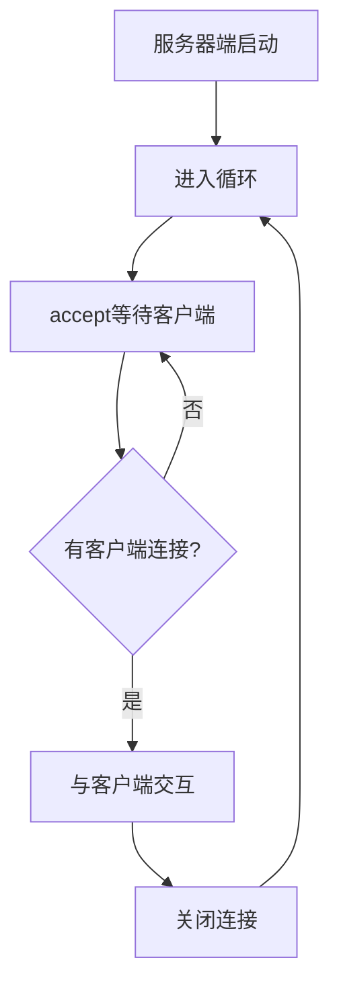

## 1.单任务版的问题

### 1.1 问题描述

单任务版服务器端只能与**一个客户端**交互一次，交互完成后程序就结束了。

```python
# 单任务版：只能与一个客户端交互一次
server_socket.listen(5)
accept_socket, info = server_socket.accept()  # 等待一个客户端
# 收发数据...
accept_socket.close()  # 关闭后程序结束
```

### 1.2 实际需求

实际开发中，服务器端需要**同时**与多个客户端交互：
- 微信服务器需要同时处理 millions 的用户请求
- Web服务器需要同时响应多个浏览器的访问

## 2.模拟多任务版

### 2.1 思路

使用**循环**模拟多任务，实现服务器端可以与多个客户端交互。

::: info 说明
真正的多任务需要使用多进程或多线程，这里使用循环来**模拟**多任务的效果。
:::

### 2.2 代码实现

```python title="05.网编案例_一句话_模拟多任务版服务器端.py"
"""
服务器端开发流程：
    1.创建服务器端Socket对象
    2.绑定Ip地址和端口号
    3.设置最大监听数
    4.等待客户端申请建立连接
    5.给客户端发送消息
    6.接收客户端的信息并打印
    7.释放资源
"""

import socket

# 1.创建服务器端Socket对象
server_socket = socket.socket(socket.AF_INET, socket.SOCK_STREAM)

# 2.绑定Ip地址和端口号
server_socket.bind(("127.0.0.1", 8080))

# 3.设置最大监听数
server_socket.listen(5)

# 循环等待客户端连接
while True:
    try:
        # 4.等待客户端申请建立连接
        accept_socket, info = server_socket.accept()

        # 5.给客户端发送消息
        accept_socket.send(b"Welcome To Socket!")

        # 6.接收客户端的信息并打印
        data = accept_socket.recv(1024).decode("utf-8")
        print(f"服务器端收到来自：{info}的数据：{data}")

        # 7.释放资源
        accept_socket.close()
    except:
        pass

# 服务器端一般不关闭
# server_socket.close()
```

### 2.3 代码说明

| 部分 | 说明 |
|:---:|:---:|
| `while True` | 循环等待客户端连接 |
| `try...except` | 捕获异常，防止某个客户端出错导致服务器崩溃 |
| `accept()` | 每次循环都等待新的客户端连接 |
| `accept_socket.close()` | 每次交互完成后关闭与该客户端的连接 |

## 3.工作原理

### 3.1 执行流程



### 3.2 模拟多任务的原理

::: info 说明
这不是真正的多任务，而是**快速轮询**：
- 服务器端在某一时刻只能与一个客户端交互
- 但由于循环执行很快，看起来像是同时与多个客户端交互
- 类似于CPU的分时复用
:::

## 4.注意事项

### 4.1 不要在客户端加循环

::: warning 重要
客户端只发送一次消息即可，**不要**在客户端加 `while True` 循环。

如果客户端加了死循环一直发送消息，会导致服务器端一直与该客户端交互，其他客户端无法连接。
:::

```python
# ❌ 错误写法：客户端加死循环
while True:
    client_socket.send("消息".encode())  # 一直发送，占用服务器

# ✅ 正确写法：客户端只发送一次
client_socket.send("消息".encode())
```

### 4.2 异常处理

使用 `try...except` 捕获异常，防止某个客户端出错导致服务器崩溃：

```python
while True:
    try:
        # 与客户端交互的代码
        accept_socket, info = server_socket.accept()
        # ...
        accept_socket.close()
    except:
        pass  # 忽略异常，继续等待下一个客户端
```

### 4.3 端口重用

在循环版本中，端口重用代码一般不需要，因为服务器端不会关闭：

```python
# 循环版本中，这行代码一般不需要
# server_socket.setsockopt(socket.SOL_SOCKET, socket.SO_REUSEADDR, True)
```

## 5.真正的多任务

### 5.1 模拟多任务的局限

模拟多任务只能**轮流**与客户端交互，不能**同时**交互：
- 某一时刻只能与一个客户端交互
- 如果某个客户端处理时间较长，其他客户端需要等待

### 5.2 真正的多任务方案

真正的多任务需要使用**多进程**或**多线程**：

```python
# 多线程版本（需要学习多线程后才能理解）
import threading

def handle_client(accept_socket):
    """处理客户端请求"""
    accept_socket.send(b"Welcome To Socket!")
    data = accept_socket.recv(1024).decode("utf-8")
    print(f"收到数据：{data}")
    accept_socket.close()

while True:
    accept_socket, info = server_socket.accept()
    # 为每个客户端创建一个新线程
    # args=(accept_socket,) 表示传递给函数的参数，注意逗号不能省略
    t = threading.Thread(target=handle_client, args=(accept_socket,))
    t.start()
```

::: info 说明
- `args=(accept_socket,)` 中的逗号**不能省略**。在Python中，单元素元组需要在元素后面加逗号，否则会被认为是普通的括号表达式。
- `threading.Thread` 的 `args` 参数要求传入一个**元组**，即使只有一个参数也要用元组形式。
- 多进程和多线程的详细内容请参考 [多线程](../multithreading/thread.md) 和 [多进程](../multithreading/process.md) 章节。
:::

## 6.运行步骤

::: warning 重要
必须**先启动服务器端**，再启动客户端。
:::

**运行步骤：**
1. 先运行服务器端代码（程序会一直在循环中等待客户端）
2. 再运行客户端代码（可以运行多个客户端）
3. 每个客户端发送数据，服务器端都会接收并回复
4. 服务器端不会退出，继续等待下一个客户端
