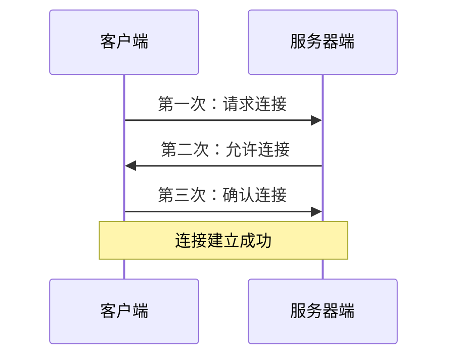
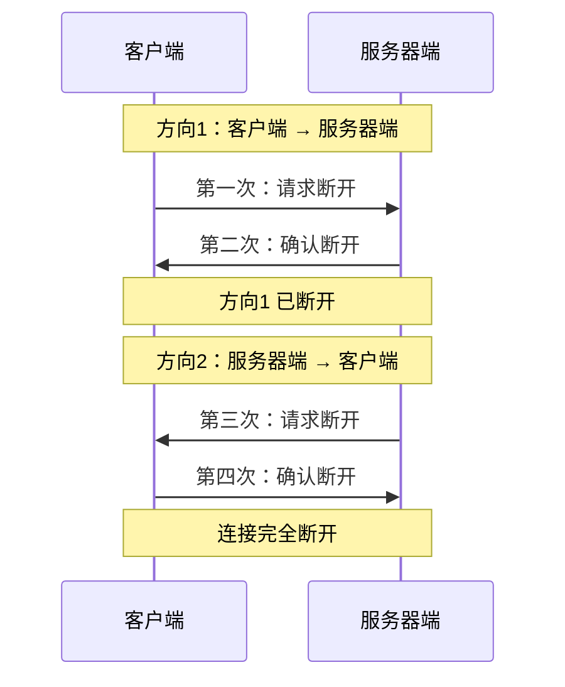

## 1.网络编程概述

### 1.1 什么是网络编程

网络编程是用来实现**不同计算机**上运行的程序间进行**数据交互**的技术。

::: info 说明
- 不同计算机：我的电脑给你的电脑传数据，这是网络编程
- 同一台计算机：我的C盘到我的D盘，这不是网络编程（这是文件传输）
- 运行的程序间：双方程序都必须处于运行状态才能通信
:::

### 1.2 网络编程三要素

| 要素 | 作用 | 说明 |
|:---:|:---:|:---:|
| IP地址 | 找到唯一的设备 | 设备在网络中的唯一标识 |
| 端口号 | 找到唯一的程序 | 程序在设备中的唯一标识 |
| 协议 | 保证通信安全 | 通信双方都要遵守的传输规则 |

## 2.IP地址

### 2.1 IP地址的概念

IP地址是**设备在网络中的唯一标识**，用于在网络中找到唯一的设备。

### 2.2 IPV4 与 IPV6

| 版本 | 字节数 | 进制 | 示例 |
|:---:|:---:|:---:|:---:|
| IPV4 | 4字节 | 十进制 | 192.168.88.100 |
| IPV6 | 8字节 | 十六进制 | 2001:0db8:85a3:0000:0000:8a2e:0370:7334 |

**IPV4 说明：**
- 每个字节的范围是 0~255
- 全球IPV4地址总数：256⁴ ≈ 42.9亿个
- 分配给亚洲的不到8亿个，导致IPV4地址不够用

**IPV6 说明：**
- 宣传语：可以让地球上的每一粒沙子都有自己的IP
- 地址数量极其庞大，解决了IPV4地址不足的问题

### 2.3 常用 DOS 命令

```bash
# Windows 查看IP
ipconfig

# Linux/Mac 查看IP
ifconfig

# 测试网络连接
ping IP地址/域名

# 循环ping（Windows）
ping -t www.baidu.com

# 循环ping（Linux/Mac）
ping -c 100 www.baidu.com
```

::: tip 说明
- 127.0.0.1 代表本机
- ping 延迟在 50ms 以内，网络比较通畅
:::

### 2.4 域名解析

域名（如 `www.baidu.com`）会被域名解析器解析为IP地址，本质底层还是IP访问。

```
www.baidu.com → 域名解析器 → 110.242.68.66 → 访问百度服务器
```

## 3.端口号

### 3.1 端口号的概念

端口号是**程序在设备中的唯一标识**，用于区分设备上不同的程序。

::: info 比喻
- 电脑 = 宾馆
- 程序 = 房间
- 端口号 = 房间号
:::

### 3.2 端口号的范围

| 范围 | 说明 |
|:---:|:---:|
| 0~1023 | 系统占用，不要使用 |
| 1024~65535 | 可以自定义使用 |

**知名端口号：**

| 端口号 | 程序 |
|:---:|:---:|
| 3306 | MySQL |
| 1521 | Oracle |
| 80 | HTTP |
| 443 | HTTPS |

### 3.3 端口号的特点

- 每个程序都有自己的端口号
- 同一台设备上，端口号不能重复
- 不同设备上，端口号可以相同

## 4.协议

### 4.1 协议的概念

协议是通信双方都要遵守的**传输规则**，保证数据能够正确传输和解析。

::: info 比喻
协议就像语言：
- 如果我说中文，你也懂中文，我们就能正常交流
- 如果我说中文，你只懂英文，就会产生误解
:::

### 4.2 常用协议

| 协议 | 特点 | 比喻 |
|:---:|:---:|:---:|
| TCP | 面向有连接、可靠、安全 | 打电话 |
| UDP | 面向无连接、不可靠、高效 | 群聊 |

## 5.TCP协议

### 5.1 TCP的特点

| 特点 | 说明 |
|:---:|:---:|
| 面向有连接 | 通信前必须先建立连接 |
| 可靠 | 采用字节流传输，理论无大小限制 |
| 安全 | 数据传输有保障 |
| 效率相对较低 | 因为安全，所以效率比UDP低 |
| 区分客户端和服务器端 | 客户端永远是客户端，服务器端永远是服务器端 |

::: tip 记忆技巧
TCP就像打电话：
- 面向有连接 → 要先拨号
- 可靠、安全 → 只有两个人能听到
- 效率相对较低 → 需要先建立连接才能通话
- 区分客户端和服务器端 → 谁打电话谁付费
:::

### 5.2 三次握手（建立连接）



**通俗理解：**
- 第一次：客户端问服务器端"约吗"
- 第二次：服务器端回复"约"
- 第三次：客户端确认"好"

### 5.3 四次挥手（断开连接）

**为什么是四次？**

因为连接是**双向**的，有四个流需要断开：
- 方向1：客户端输出流 → 服务器端输入流
- 方向2：服务器端输出流 → 客户端输入流

每个方向断开需要两次（请求+确认），所以一共需要四次。



**通俗理解：**
- 第一次：客户端说"咱俩断了吧"
- 第二次：服务器端说"好，断了"（方向1断开）
- 第三次：服务器端说"那咱俩也断了吧"
- 第四次：客户端说"好，断了"（方向2断开）

### 5.4 数据传输

建立连接后，数据通过**四个流**进行传输：

| 流 | 方向 | 说明 |
|:---:|:---:|:---:|
| 客户端输出流 | 客户端 → 服务器端 | 客户端发送数据 |
| 服务器端输入流 | 客户端 → 服务器端 | 服务器端接收数据 |
| 服务器端输出流 | 服务器端 → 客户端 | 服务器端发送数据 |
| 客户端输入流 | 服务器端 → 客户端 | 客户端接收数据 |

## 6.UDP协议

| 特点 | 说明 |
|:---:|:---:|
| 面向无连接 | 不需要建立连接 |
| 不可靠 | 采用数据包发送，每个包不超过64KB |
| 可能丢包 | 不保证数据一定到达 |
| 效率高 | 不需要建立连接，直接发送 |

::: info 比喻
UDP就像群聊：
- 不需要先建立连接 → 直接在群里发消息
- 可能丢包 → 有人可能没看到消息
- 效率高 → 一条消息所有人都能收到
:::

## 7.TCP vs UDP 对比

| 对比项 | TCP | UDP |
|:---:|:---:|:---:|
| 连接方式 | 面向有连接 | 面向无连接 |
| 可靠性 | 可靠 | 不可靠 |
| 传输方式 | 字节流 | 数据包 |
| 数据大小 | 理论无限制 | 每个包不超过64KB |
| 效率 | 相对较低 | 高 |
| 安全性 | 安全 | 可能丢包 |
| 比喻 | 打电话 | 群聊 |

## 8.Socket编程简介

### 8.1 什么是Socket

网络编程也叫**Socket编程**，通信双方都拥有自己的Socket对象，数据在两个Socket之间通过字节流或数据包进行传输。

::: info 比喻
Socket就像手机：
- 通信双方都需要手机（Socket对象）
- 数据通过手机进行传输
- 虽然是人在交流，但实际上是手机在通信
:::

### 8.2 创建Socket对象

```python title="01.创建socket对象.py"
import socket

# 参数1：Address Family，地址簇，IPV4还是IPV6
# 参数2：Socket Type，套接字类型，TCP还是UDP
tcp_socket = socket.socket(socket.AF_INET, socket.SOCK_STREAM)
print(tcp_socket)
```

**参数说明：**

| 参数 | 值 | 说明 |
|:---:|:---:|:---:|
| Address Family | `AF_INET` | IPV4（默认） |
| Address Family | `AF_INET6` | IPV6 |
| Socket Type | `SOCK_STREAM` | TCP（默认） |
| Socket Type | `SOCK_DGRAM` | UDP |

### 8.3 TCP开发流程

**服务器端流程：**
1. 创建Socket对象
2. 绑定IP和端口号
3. 设置最大监听数
4. 等待客户端连接
5. 收发数据
6. 关闭连接

**客户端流程：**
1. 创建Socket对象
2. 连接服务器
3. 收发数据
4. 关闭连接
