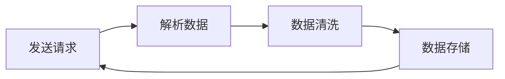

## 1.网络机器人概述

### 1.1 什么是网络机器人

网络机器人（Web Crawler）也称为**网络爬虫**，是指按照一定的预设规则，自动浏览并抓取网络数据的程序或脚本。

**应用场景：**
- **搜索引擎**：百度、谷歌等搜索引擎通过网络机器人抓取互联网上的网页内容，建立索引库
- **电商比价**：比价系统通过爬虫获取各电商平台的商品价格数据
- **AI训练数据**：大模型训练需要大量语料数据，通过网络机器人采集
- **舆情监控**：实时抓取社交媒体、新闻网站的数据进行分析

### 1.2 工作流程

网络机器人的工作流程主要包括以下四个步骤：



1. **发送请求**：向目标网站发送 HTTP 请求，获取响应数据
2. **解析数据**：从响应的 HTML 代码中提取所需数据
3. **数据清洗**：对原始数据进行处理、修正，转化为标准化数据
4. **数据存储**：将处理后的数据保存到文件或数据库中

### 1.3 开发规范 - robots 协议

在开发网络机器人之前，必须了解并遵守 **robots 协议**。

**robots 协议**（也称爬虫协议）是指在网站根目录下存放的一份文本文件 `robots.txt`，用于告诉网络机器人哪些页面可以抓取，哪些页面不能抓取。

::: warning 注意
robots 协议是一种"君子协议"，没有法律强制约束力，但作为开发者应当遵守职业道德，尊重网站的爬取规则。
:::

**robots.txt 常见规则：**

| 规则 | 说明 | 示例 |
|:---:|:---|:---|
| `User-agent` | 用户代理，标识网络机器人身份 | `User-agent: *`（所有机器人） |
| `Disallow` | 禁止访问的资源路径 | `Disallow: /wp-admin/` |
| `Allow` | 允许访问的资源路径（例外） | `Allow: /wp-admin/admin-ajax.php` |
| `Sitemap` | 网站地图，帮助机器人高效获取内容 | `Sitemap: https://example.com/sitemap.xml` |
| `Crawl-delay` | 抓取间隔时间（秒），避免频繁访问 | `Crawl-delay: 5` |

**查看 robots.txt 方法：** 在浏览器中访问 `网站域名/robots.txt` 即可查看。

## 2.requests 库入门

### 2.1 安装 requests

`requests` 是 Python 中最流行的 HTTP 客户端库，用于发送网络请求。它不是 Python 标准库，需要手动安装：

```bash
pip install requests
```

### 2.2 发送 GET 请求

```python title="01.网络机器人-入门程序.py"
import requests

# 定义目标 URL
target_url = "https://www.tiobe.com/tiobe-index/"

# 发送 GET 请求
response = requests.get(target_url)

# 获取响应文本数据
print(response.text)
```

**常用请求方法：**

| 方法 | 说明 |
|:---:|:---|
| `requests.get(url)` | 发送 GET 请求 |
| `requests.post(url, data)` | 发送 POST 请求 |
| `requests.request(method, url)` | 发送指定方式的请求 |

::: info 说明
在浏览器地址栏中发起的所有请求都是 GET 请求。
:::

## 3.网页结构

网页底层都是由前端代码组成的，主要包括三个部分：

### 3.1 HTML - 超文本标记语言

HTML（HyperText Markup Language，超文本标记语言）负责网页的**结构和内容**。

**超文本**：超越了普通文本的限制，比普通文本更强大，除了文字以外还可以引入图片、音频、视频、超链接等。

**标记语言**：由标签构成的语言。标签由 `<` 和 `>` 包裹，如 `<h1>`。

**标签的基本语法：**

```html
<!-- 开始标签和结束标签配对使用，结束标签前加 / -->
<h1>一级标题</h1>
<p>段落文本</p>

<!-- 标签可以嵌套使用 -->
<div>
    <h2>标题</h2>
    <p>内容</p>
</div>

<!-- 标签属性：key=value 形式 -->
<a href="https://example.com">超链接</a>

```

::: info 说明
- **开始标签**：`<标签名>`，如 `<h1>`
- **结束标签**：`</标签名>`，如 `</h1>`
- **自闭合标签**：没有结束标签，如 ``、`<br>`
- **属性**：写在开始标签内，格式为 `key="value"`
:::

**常见 HTML 标签：**

| 标签 | 说明 |
|:---:|:---|
| `<h1>`~`<h6>` | 标题标签 |
| `<p>` | 段落标签 |
| `<div>` | 容器标签 |
| `<a>` | 超链接标签 |
| `` | 图片标签 |
| `<table>` | 表格标签 |
| `<ul>`/`<ol>` | 无序/有序列表 |
| `<span>` | 行内容器标签 |

### 3.2 CSS - 层叠样式表

CSS（Cascading Style Sheets）负责网页的**样式和布局**，控制元素的颜色、大小、位置等外观属性。

### 3.3 JavaScript - 脚本语言

JavaScript（简称 JS）负责网页的**交互和动态行为**，如点击事件、数据加载、页面动画等。

## 4.网页解析 - lxml 库

### 4.1 安装 lxml

```bash
pip install lxml
```

### 4.2 解析 HTML 文档

使用 `lxml` 库可以将 HTML 文本解析为文档对象，然后通过 XPath 语法提取数据：

```python title="02.网络机器人-网页解析.py"
from lxml import html

# HTML 文本
html_doc = """
<html>
<body>
    <table>
        <thead>
            <tr><th>排名</th><th>语言</th><th>份额</th></tr>
        </thead>
        <tbody>
            <tr><td>1</td><td>Python</td><td>22.61%</td></tr>
            <tr><td>2</td><td>C</td><td>15.23%</td></tr>
        </tbody>
    </table>
</body>
</html>
"""

# 解析 HTML 文本为文档对象
doc = html.fromstring(html_doc)

# 提取表头
th_list = doc.xpath("//table/thead/tr/th/text()")
print(th_list)  # ['排名', '语言', '份额']

# 提取所有行数据
tr_list = doc.xpath("//table/tbody/tr")
for tr in tr_list:
    td = tr.xpath("./td/text()")
    print(td)
```

## 5.XPath 语法详解

XPath 是一种在 HTML/XML 文档中查找信息的语言，通过路径表达式来选取节点。

### 5.1 基本路径表达式

| 表达式 | 说明 | 示例 |
|:---:|:---|:---|
| `/` | 从根节点开始匹配，查找直接子元素 | `/html/body/div` |
| `//` | 从任意位置开始匹配 | `//table` |
| `.` | 从当前节点开始查找 | `./td` |
| `..` | 选取当前节点的父节点 | `../..` |
| `@` | 选取属性 | `@class` |

::: warning `/` 和 `//` 的区别
- `/`：从根节点开始，一级一级往下查找直接子元素
- `//`：从文档任意位置开始查找，不需要关心上层元素是什么
:::

### 5.2 常用示例

```python title="03.网络机器人-xpath语法.py"
from lxml import html

doc = html.fromstring(html_text)

# /：从根节点开始匹配直接子元素（需要完整路径）
th_list = doc.xpath("/html/body/div/div/table/thead/tr/th/text()")

# //：从任意位置开始匹配（推荐使用）
th_list = doc.xpath("//table/thead/tr/th/text()")
th_list = doc.xpath("//thead/tr/th/text()")  # 可以省略中间层级

# .：从当前节点开始查找（在遍历时使用）
tr_list = doc.xpath("//tbody/tr")
for tr in tr_list:
    td = tr.xpath("./td/text()")  # 当前 tr 下的 td

# [n]：选取第 n 个元素（从 1 开始）
tb_list = doc.xpath("//tbody/tr[1]/td/text()")  # 第 1 行
tb_list = doc.xpath("//tbody/tr[2]/td/text()")  # 第 2 行

# last()：选取最后一个元素
tb_list = doc.xpath("//tbody/tr[last()]/td/text()")  # 最后一行
tb_list = doc.xpath("//tbody/tr[last()-1]/td/text()")  # 倒数第二行

# @class：匹配具有 class 属性的标签
p_list = doc.xpath("//p[@class]/text()")

# [@class='xn']：匹配 class 属性值为 xn 的标签
p_list = doc.xpath("//p[@class='xn']/text()")

# *：匹配任意标签（通配符）
th_list = doc.xpath("//thead/tr/*/text()")

# @*：匹配任意属性
img_list = doc.xpath("//td/img/@*")

# @src：匹配 src 属性值
img_list = doc.xpath("//td/img/@src")

# text()：获取元素的文本内容
text_list = doc.xpath("//p/text()")
```

### 5.3 完整示例 - 抓取 TIOBE 排行榜

```python title="01.网络机器人-入门程序.py"
import requests
from lxml import html

# 定义 url
target_url = "https://www.tiobe.com/tiobe-index/"

# 发送请求，获取数据
response = requests.get(target_url)

# 解析数据
document = html.fromstring(response.text)

# 解析表头
th_list = document.xpath("//table[@id='top20']/thead/tr/th/text()")
print(th_list)

# 解析数据
tr_list = document.xpath("//table[@id='top20']/tbody/tr")
for tr in tr_list:
    tb = tr.xpath("./td/text()")
    print(tb)
```
